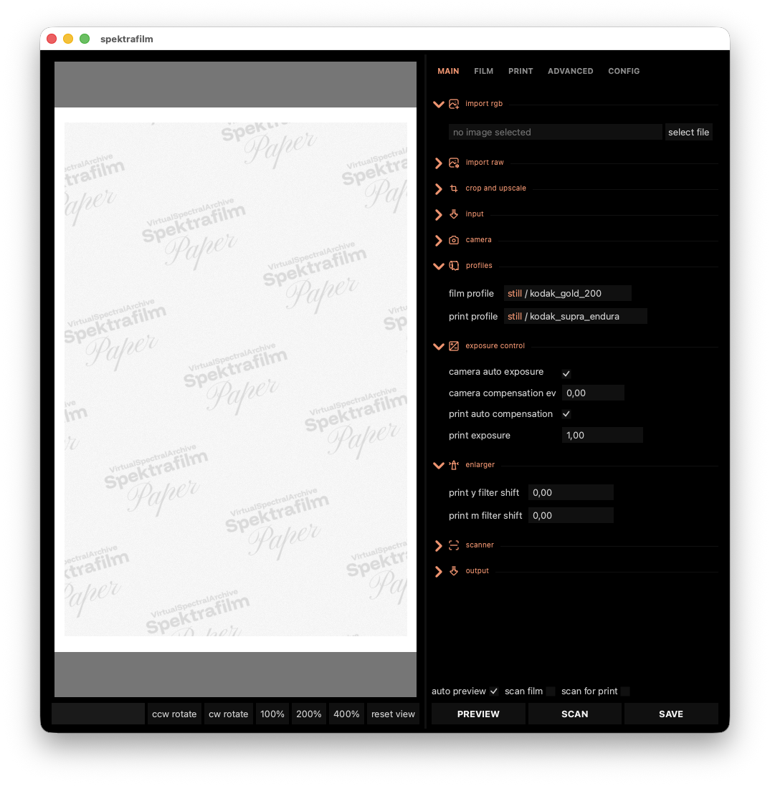
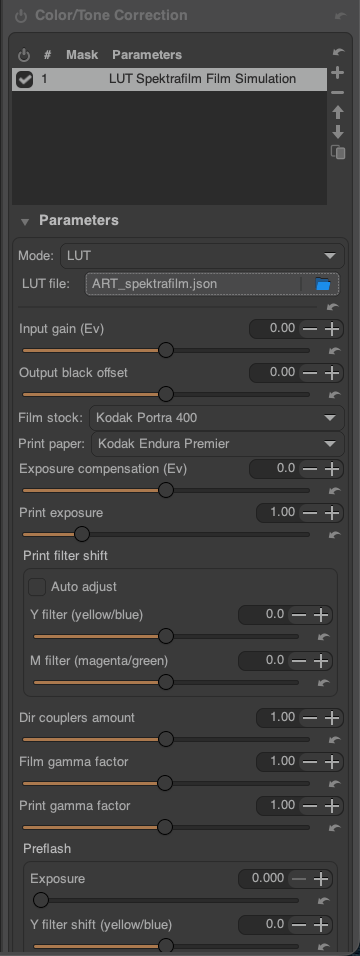
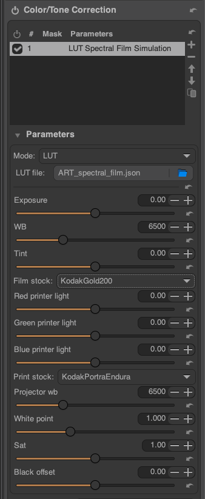

# Spectral film simulations in ART

*(with contributions by [Leopoldo Saggin](mailto:leopoldo.saggin@yahoo.com) and [Sébastien Guyader](https://discuss.pixls.us/u/sguyader))*

This article shows how to integrate two recent projects for emulating
the look of various film stocks using a physics-based simulation
pipeline in ART, namely
[*spektrafilm*](https://github.com/andreavolpato/spektrafilm)
and [*Spectral Film LUT*](https://github.com/JanLohse/spectral_film_lut).

The instructions should work for any major platform supported by ART itself.
The integration is based on the *external 3dLUT* feature available in ART since version 1.25.3.

**Contents:**
- [Initial environment setup](#initial-setup)
- [Integration of *spektrafilm*](#spektrafilm)
- [Integration of *Spectral Film LUT*](#spectral-film-lut)

## Initial environment setup {#initial-setup}

Since both *agx-emulsion* and *Spectral Film LUT* rely on Python, the use of a virtual environment for Python is recommended. Here we will describe how to install and use `virtualenv` which is a fast, cross-platform tool for managing isolated Python environments which allow installing and running different versions of Python.

In case you don't have Python installed already, install a recent version (from <https://www.python.org/> for example). If your Python version is \< 3.8, please update.

**Note for Windows users:** it seems like the current version of Python at the time of writing (version 3.14) prevents installing Python 3.13 from the `virtualenv`. It is suggested to directly install Python 3.13 as the main Python version on your system.

Now you can install `pipx` for your OS from here: <https://pipx.pypa.io/stable/installation/>.

To install *virtualenv*, run the following commands in a terminal (for Windows, **cmd.exe** or **PowerShell**):

```
pipx install virtualenv
pipx ensurepath
```

Now close your terminal window, open a new terminal and create a virtual environment called *ART-filmsim*.

For Windows:

```
virtualenv --python 3.13 c:\users\<username>\envs\ART-filmsim
```

For macOS/Linux:

```
virtualenv --python 3.13 ~/envs/ART-filmsim
```

This will create a new `envs` folder in your home user directory, of course you can change it to the path/forlder name you like but don't forget to update the following commands.

## Integration of *spektrafilm* {#spektrafilm}

### Activating the virtual environment

For **Windows**:

- if you use **cmd.exe** type:

```
c:\users\<username>\envs\ART-filmsim\Scripts\activate.bat
```

- if you use **PowerShell**:

```
c:\users\<username>\envs\ART-filmsim\Scripts\Activate.ps1
```

For **macOS/Linux**:

```
source ~/envs/ART-filmsim/bin/activate
```

Once the Python virtual environment is activated,
you will see `(ART-filmsim)` displayed in the command prompt.

### Dowloading the *spektrafilm* code

As spektrafilm is in active development, it is recommended to use one
of the official releases rather than working from the git repository
directly.  At the time of writing this, the latest release is v0.3.2,
which can be downloaded from
https://github.com/andreavolpato/spektrafilm/releases/.  You can just
download a zip/tarball of the release, and extract its content to
`/path/to/local/spektrafilm`.

### Installing *spektrafilm*

With the `(ART-filmsim)` environment active in your terminal, type:

```bash
cd /path/to/local/spektrafilm
pip install -e .
```

And launch the GUI:

```bash
spektrafilm
```

If everything went well, a window should pop up which will let you experiment with *spektrafilm*. For instance, you can load the provided test image (located in `/path/to/local/spektrafilm/img/test`) or any image of your choice and play with the film and print emulsions to ensure the module works.



### Integration in ART

In order to use the module in ART, download the support scripts
[ART_spektrafilm.json](https://github.com/artraweditor/ART/raw/refs/heads/master/tools/extlut/ART_spektrafilm.json) and
[spektrafilm_mklut.py](https://github.com/artraweditor/ART/raw/refs/heads/master/tools/extlut/spektrafilm_mklut.py),
and save them *both in the same directory* of your choice. **It is crucial that both files reside in the same directory**.

***Note:*** the most convenient place to save both files is the 3D LUT directory declared in ART's **Preferences \> Image Processing \> Directories \> CLUT directory**.

***ART_spektrafilm.json*** is a configuration file which sets the Python command to run the script ***spektrafilm_mklut.py***. By default the command is:

``` json
    "command" : "python3 spektrafilm_mklut.py --server",
```

Since the actual command depends on your operating system and Python install environment, you need to open it with a text editor and edit **line 12** to point to the *Python interpreter* you used to install *spektrafilm*.

If you followed the instructions above to install *virtualenv* and Python 3.13, you will need to update this command with:

(for Windows)

``` json
    "command" : "C:\\users\\<username>\\envs\\ART-filmsim\\bin\\python spektrafilm_mklut.py --server",
```

(for Linux and macOS)

``` json
    "command" : "/home/<username>/envs/ART-filmsim/bin/python spektrafilm_mklut.py --server",
```

and save the file. Please also note the presence of a "**comma**" at the end of the line!

Now when you restart ART you should be able to load ***ART_spektrafilm.json*** as a **LUT** from the "*Color/Tone Correction*" tool in the "Local editing" tab, or from the "Film Simulation" tool in the "Special Effects" tab.

At this point you can test if everything works:

1.  Open an image in ART
2.  Activate the "*Color/Tone Correction*" tool and, from its "*Mode"* dropdown menu select **LUT** (note that default mode is generally *Standard* or *Perceptual*)
3.  The program will ask for a *LUT file*
4.  Select ***ART_spektrafilm.json***
5.  At this point a large set of parameters appears, as reported in the image below, and you can play and choose the film simulation you wish to simulate etc...



### Updating *spektrafilm* 

In order to keep both the ***spektrafilm*** Python code base and its support in ART up to date:

1.  update your local spektrafilm version by downloading the new release from 
    GitHub and refer to the second command in the [spektrafilm section](#spektrafilm-installation) above
2.  download the ***spektrafilm_mklut.py*** and
    ***ART_spektrafilm.json*** files from
    <https://github.com/artraweditor/ART/tree/master/tools/extlut>
    again, and replace the existing files in ART's **CLUT directory**
    with the new ones.

## Integration of *Spectral Film LUT* {#spectral-film-lut}

The procedure is very similar to the one above for *spektrafilm*.
The description assumes a Unix (i.e. Linux/macOS) environment, see above for the Windows-specific changes.

First, we activate the Python virtual environment:

```
source ~/envs/ART-filmsim/bin/activate
```

Then, install *Spectral Film LUT*:

```
pip install git+https://github.com/JanLohse/spectral_film_lut
pip install matplotlib networkx opencv-python
```

In order to use the module in ART, download the support scripts
[ART_spectral_film.json](https://github.com/artraweditor/ART/raw/refs/heads/master/tools/extlut/ART_spectral_film.json) and
[spectral_film_mklut.py](https://github.com/artraweditor/ART/raw/refs/heads/master/tools/extlut/spectral_film_mklut.py),
save them both in the same directory of your choice,
and modify the `"command"` line of `ART_spectral_film.json` to use the Python interpreter from the virtualenv above, changing it from:

```json
    "command" : "python3 spectral_film_mklut.py --server",
```

to:

```json
    "command" : "/home/<username>/envs/ART-filmsim/bin/python spectral_film_mklut.py --server",
```

Now you can load the `ART_spectral_film.json` file as LUT in the *"Color/Tone Correction"* tool:



And if you want, you can also put it in your configured CLUT directory to have it appear in the *"Film Simulations"* tool.

## Disclaimer

All the information provided on this document is provided on an "*as-is*" basis and you agree that you use such information entirely at *your own risk*. We give *no warranty* and accept *no responsibility or liability for the accuracy or the completeness of the information contained in this document*. 

*(Version 0.5  -- 2026/05/30)*
